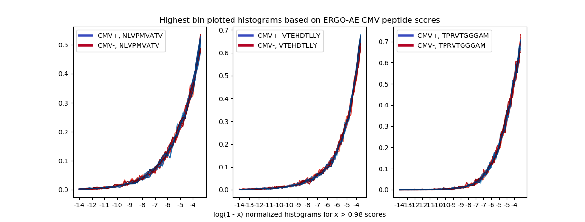
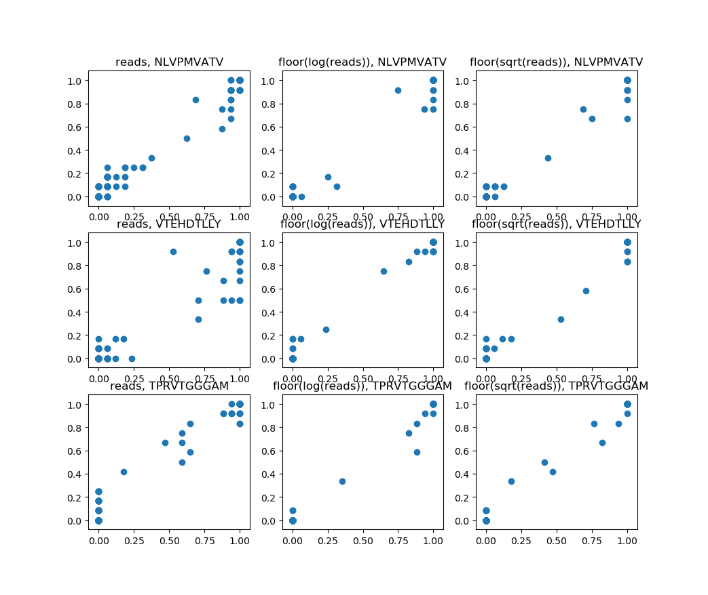

# Repertoire Analysis and Classification
We have developed the ERGO models in order to detect binding of specific TCRs and peptides.
The next level will be applying those methods in order to classify a full TCR repertoire.

## Report 9.7.19 :computer:
ERGO original code was modified for test predictions.
(We now use pytorch batching and loading methods, it is neater.)

## Report 11.7.19 :pencil2:
### High ERGO Scores on CMV Repertoires
ERGO trained model can predict a binding score for every given TCR and peptide.
In order to classify a repertoire, we will use these scores for every TCR in the repertoire.
We are using Emerson et al. CMV associated repertoires (CMV+ and CMV-), together with CMV peptides in McPAS-TCR database,
mainly NLVPMVATV (the most frequent one).

Given a repertoire, we pair every TCR with the CMV peptide. Next, we check for predicted ERGO scores of the pairs.
The tables below show how many TCRs in a repertoire get a high CMV-binding score:

pathology | model | repertoire size | number of TCRs with score > 0.99 | score > 0.999
--- | --- | --- | --- | ---
CMV+| LSTM | 159833 | 4305 (2.69%) | 745 (0.466%)
CMV-| LSTM | 104186 | 2835 (2.72%) | 500 (0.479%)
CMV+| AE   | 159833 |    | 2341 (1.46%)
CMV-| AE   | 104186 |    | 1686 (1.61%)

Currently it is hard to see any difference between repertoires.

## Report 16.7.19 :bar_chart:
One repertoire might not be enough, so we took 10 CMV+ and 10 CMV- repertoires.

The CMV+ and CMV- distributions still look very similar.
We looked over the whole histograms:

The model learns to dump the scores to the edges (thanks to cross-entropy loss).
We are interested in the highest bin of the histogram. We expect that CMV+ repertoires will be
closer to the '1' edge.

(The histograms above are not normalized and are affected by the repertoire size)

Since only the last bin is important, we looked for a way to examine it.
We took +-log(1-bin) histograms for the highest bin (score > 0.98) in every repertoire
(because it should be close to 1).

Now the histograms are normalized.
The left side is CMV- repertoires, and the right side is CMV+.
Again, currently we do not see major differences.

## Report 18.7.19 :scroll:
### Saving ERGO predictions
We saved ERGO model predictions for the current repertoires (10 CMV+ and 10 CMV-),
paired with several CMV peptides.
Next week we will try to extract the predictions for all repertoires in Emerson et al. data, and for other
pathology-associated databases.

### Plotted histograms
We would like to compare between the CMV+ and CMV- histograms showed earlier.
Given the log(1-x) of the highest bin histograms, 
the histograms were normalized to a density function for each repertoire (forgetting the repertoire size),
and then were plotted together, distinguishing CMV+ and CMV- repertoires.

 
## Report 18.7.19 :pushpin:
### More CMV peptides
Continuing the histograms from the last week, we checked the scores for other frequent peptides associated with CMV.
This time we tried both ERGO models (AE and LSTM).

## Report 28.7.19 :bulb:
### Matching HLA types
Instead of predicting all repertoires scores and trying to distinguish CMV status,
we now check only repertoires containing the HLA type of the peptide.

CMV peptide | HLA type
--- | ---
NLVPMVATV | HLA-A*02
VTEHDTLLY | HLA-A*01
TPRVTGGGAM | HLA-B*07

Next, we can look on the histograms as before

The scores are noisy due to a large number of naive TCRs.
We will try next to reduce the naive TCRs in the repertoire,
by identifying TCRs that do not bind the top frequent peptides.

## Report 1.8.19 :email:
### Separating naive and memory TCRs using ERGO
We tried using ERGO scores in order to distinguish between naive and
memory TCRs. Using benny chain's data, we took the most frequent peptides in McPAS dataset,
and scored each TCR in the repertoire paired with one peptide at a time using ERGO trained model.
Scores were extracted by one naive repertoire and one memory repertoire (of the same patient).
(We tried to use all of the data, but currently due to disk quota problems on the DSI server
it is not done yet).

Next, we used the scores to build a classifier. For evey TCR, the maximal score of all peptides
was taken. We wanted a continuous classification score in order to extract a ROC curve,
so the maximum, and then the average, with similar results, were taken.
We then checked for ROC and AUC of the classifier, but unfortunately
it did not separate naive and memory.

## Report 7.8.19 :blue_book:
### Scores PCA
Currently we have methods for scoring a single TCR, but not the whole repertoire.
We have suggested a method aiming to reduce the noise in the repertoire scores.
At first we use ERGO trained model to score each TCR in each Emerson et al. repertoires,
paired with frequent CMV peptides.
Then we build a score matrix for every peptide, by taking a fixed-size column of scores,
from each repertoire (paired with the relevant peptide).
We apply PCA and reduce the number of scores of each repertoire.
Here, using 2 PCA components, we show the different repertoires scores for each CMV peptide:

Next we plan to reduce the naive TCRs score variance, this might help distinguishing
CMV+ and CMV- repertoires.

## Report 2.9.19
### Reads factor histograms
Until now, we did not consider the number of TCR reads in the repertoire
(except for an early trial to take the number of templates).
We extracted from Emerson et al. data the TCRs along with the number of reads for all repertoires,
and run as usual the ERGO predictions for some CMV peptides.

As before, we extracted the score histograms for log(1-x) for scores x > 0.98.
We used the number of TCR reads as a multiplication factor to the score.

## Report 3.9.19
### Cumulative histograms
Taking the reads factor score distribution, we looked over the
cumulative distribution histograms for some of the CMV+ and the CMV- repertoires.
(These histograms are not normalized).

### Reads cutoff
In addition, we extracted another score distribution,
of the ERGO scores for TCRs with at least 10 reads in the sample.
(It is only cutoff, we did not multiplied the scores with the reads) 
Here it is harder to see any difference between CMV+ and CMV- samples.
We considered the whole CMV samples.

## Report 8.9.19
### Normalized cumulative
We normalized the last cumulative histograms, and expanded it to more CMV repertoires.
A small difference between CMV+ and CMV- can be noticed.

### More reads factors
Instead of just multiplying the scores with the TCRs reads in the score distribution,
we tried different reads factors, as log(reads) and sqrt(reads) (score * the floor of it).
The outcome cumulative histograms are shown

### Histograms area ROC
Since there is a difference between CMV+ and CMV- distributions, we wanted to
get a ROC curve of the histograms. Each histogram got a score - the area under the histogram
divided by twice the average of histograms areas. In this way most of the histograms are
around 0.5, when CMV- histograms should get 0 and CMV+ histograms should get 1.

ROC curve was extracted based on these histograms scores for every peptide and every
reads factor that was tried.

## Report 10.9.19
### Grid plots
The previous ROC curve did not show a clear classification. We tried another method.
A grid of 20*20 (x,y) points was chosen. for every (x,y) point, we took the fraction of
CMV- histograms that uphold h(x) > y, and the same for CMV+ histograms, and plotted the fractions
in a new point (frac_cmv-, frac_cmv+). This was done for all peptides and all reads factors,
for some of the CMV samples.

## Report 11.9.19
# Grid plots
Same as yesterday, we extracted a grid plot, this time for other CMV samples (of the same size).
We can again see a clear separation point in the left middle square.

###ERGO on diabetes
A new dataset related with Type 1 diabetes was given.
We run ERGO model with diabetes peptides to extract repertoire scores.
Soon we will be able to extract score histograms as in the Emerson et al. CMV dataset. 